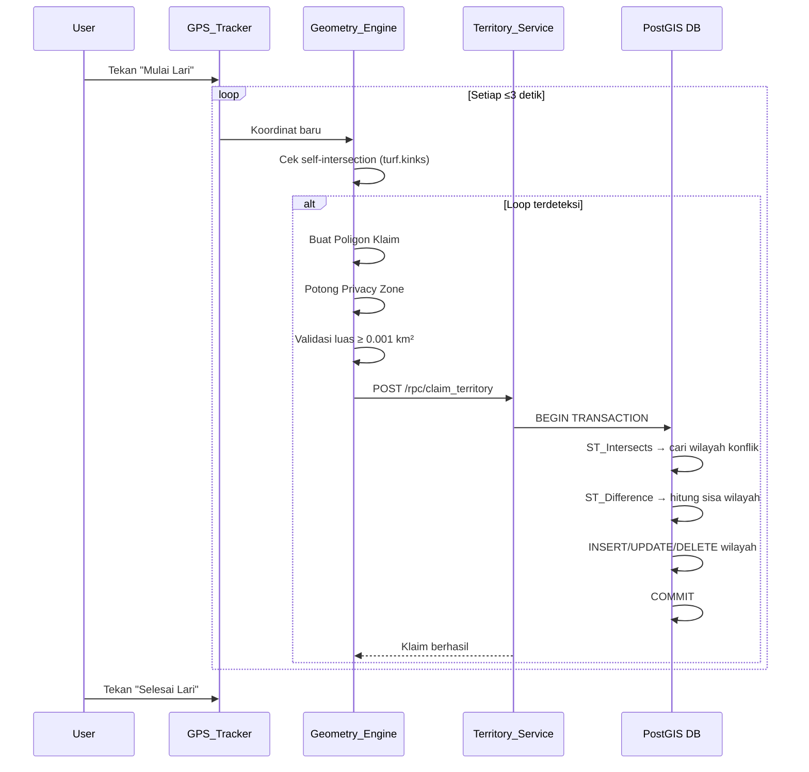
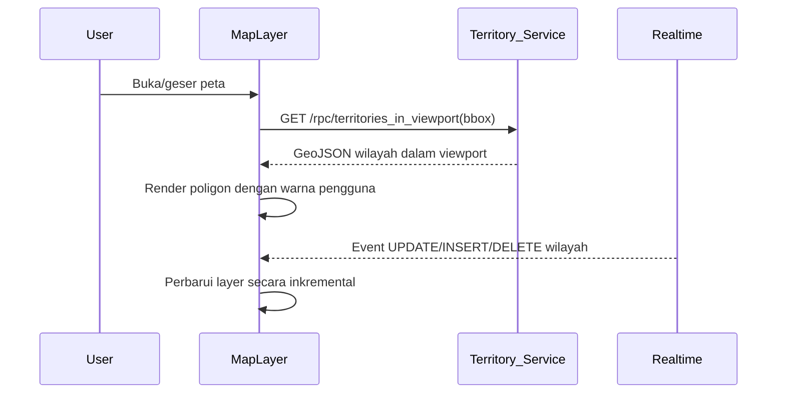

# Dokumen Desain Teknis - Territory Jogger

## Ikhtisar

Territory Jogger adalah aplikasi mobile gamifikasi jogging yang menggabungkan mekanik *area control* dari game .io dengan peta dunia nyata. Pengguna berlari di dunia nyata untuk mengklaim wilayah di peta, memotong wilayah milik pengguna lain, dan bersaing di leaderboard berdasarkan luas area yang dikuasai.

### Tujuan Teknis

- Merekam jalur GPS secara akurat dan efisien di foreground maupun background
- Mendeteksi loop tertutup secara real-time dan menghasilkan poligon klaim
- Menyelesaikan konflik wilayah (slicing) secara atomik di sisi server
- Menampilkan peta interaktif dengan ratusan wilayah tanpa degradasi performa
- Menjaga privasi pengguna melalui mekanisme Privacy Zone

### Stack Teknologi

| Layer | Teknologi |
|---|---|
| Frontend | Vite + React + TypeScript |
| Mobile Wrapper | Capacitor.js v6 |
| Peta | Leaflet.js v1.9 |
| Geometri | Turf.js v7 |
| Backend | Supabase (PostgreSQL 15 + PostGIS 3.4) |
| Realtime | Supabase Realtime (WebSocket) |
| Notifikasi | Supabase Edge Functions + FCM/APNs |
| Background GPS | `@transistorsoft/capacitor-background-geolocation` |

> **Catatan Riset**: Capacitor Geolocation API bawaan tidak mendukung background tracking secara penuh. Plugin `@transistorsoft/capacitor-background-geolocation` diperlukan untuk memastikan perekaman GPS tetap berjalan saat aplikasi di-minimize (Persyaratan 3.2). Plugin ini mendukung iOS Background Modes dan Android foreground service.

---

## Arsitektur

### Gambaran Umum Arsitektur

Aplikasi menggunakan arsitektur **client-heavy** di mana sebagian besar logika geometri dijalankan di sisi klien (Turf.js) untuk mengurangi latensi, sementara operasi yang memerlukan konsistensi data (slicing, penyimpanan wilayah) dijalankan di sisi server (Supabase Edge Functions + PostGIS).

```mermaid
graph TB
    subgraph "Mobile Client (Capacitor)"
        UI[React UI Layer]
        GPS[GPS_Tracker\n@transistorsoft/bg-geo]
        GE[Geometry_Engine\nTurf.js]
        MAP[Map Layer\nLeaflet.js]
    end

    subgraph "Supabase Backend"
        AUTH[Auth Service\nSupabase Auth]
        DB[(PostgreSQL + PostGIS\nterritories, profiles, privacy_zones)]
        RT[Realtime\nWebSocket]
        EF[Edge Functions\nDeno]
        NOTIF[Notification Service\nEdge Function + FCM/APNs]
    end

    UI --> GPS
    GPS --> GE
    GE --> UI
    UI --> MAP
    UI <-->|REST / RPC| DB
    UI <-->|WebSocket| RT
    RT --> UI
    UI --> AUTH
    EF --> DB
    EF --> NOTIF
    DB --> RT
```

### Alur Data Utama

#### Alur Klaim Wilayah



#### Alur Visualisasi Peta



---

## Komponen dan Antarmuka

### 1. GPS_Tracker

**Tanggung Jawab**: Merekam koordinat GPS secara kontinu, memvalidasi kecepatan, dan mengelola siklus hidup sesi lari.

**Antarmuka**:

```typescript
interface GPSTracker {
  startSession(): Promise<void>;
  stopSession(): Promise<TrackData>;
  getCurrentPosition(): Coordinate;
  onPositionUpdate(callback: (coord: Coordinate) => void): void;
  onSpeedViolation(callback: () => void): void;
  onGPSLost(callback: () => void): void;
}

interface Coordinate {
  lat: number;
  lng: number;
  timestamp: number;
  accuracy: number; // meter
  speed: number;    // m/s
}

interface TrackData {
  coordinates: Coordinate[];
  startTime: number;
  endTime: number;
  totalDistance: number; // km
}
```

**Implementasi**:
- Menggunakan `BackgroundGeolocation.watchPosition()` dari `@transistorsoft/capacitor-background-geolocation`
- Konfigurasi: `desiredAccuracy: BackgroundGeolocation.DESIRED_ACCURACY_HIGH`, `distanceFilter: 5` (meter)
- Speed Guard: buffer kecepatan 10 detik terakhir; jika rata-rata > 20 km/jam → hentikan sesi
- GPS Lost: jika tidak ada update selama 30 detik → pause sesi dan tampilkan peringatan
- Debounce pembaruan peta: maksimum 1 update/detik ke layer Leaflet

### 2. Geometry_Engine

**Tanggung Jawab**: Menjalankan semua operasi geometri di sisi klien menggunakan Turf.js.

**Antarmuka**:

```typescript
interface GeometryEngine {
  detectLoop(track: Coordinate[]): LoopDetectionResult | null;
  createClaimPolygon(track: Coordinate[], loopResult: LoopDetectionResult): Feature<Polygon>;
  applyPrivacyZones(polygon: Feature<Polygon>, zones: PrivacyZone[]): Feature<Polygon> | null;
  simplifyPolygon(polygon: Feature<Polygon>): Feature<Polygon>;
  calculateArea(polygon: Feature<Polygon>): number; // km²
  isValidClaim(polygon: Feature<Polygon>): boolean;
}

interface LoopDetectionResult {
  intersectionPoint: Position;
  loopStartIndex: number;
  loopEndIndex: number;
}
```

**Algoritma Deteksi Loop**:
1. Setiap kali koordinat baru ditambahkan, buat LineString dari seluruh jalur
2. Panggil `turf.kinks(lineString)` untuk mendeteksi self-intersection
3. Jika ada intersection point, ekstrak sub-jalur yang membentuk loop
4. Buat polygon dari sub-jalur tersebut menggunakan `turf.polygon()`
5. Simplifikasi dengan `turf.simplify(polygon, { tolerance: 0.00001, highQuality: true })`
6. Hitung luas dengan `turf.area(polygon)` → konversi ke km²

**Penanganan Privacy Zone**:
- Untuk setiap Privacy Zone aktif, buat circle polygon: `turf.circle(center, radius, { units: 'meters' })`
- Potong bagian polygon klaim yang berada di dalam zone: `turf.difference(claimPolygon, privacyCircle)`
- Jika hasil `difference` adalah null → batalkan klaim

### 3. Territory_Service (Supabase RPC)

**Tanggung Jawab**: Menyimpan, memperbarui, dan mengambil data wilayah dengan konsistensi penuh.

**Antarmuka RPC**:

```sql
-- Klaim wilayah baru (menangani slicing secara atomik)
CREATE OR REPLACE FUNCTION claim_territory(
  p_user_id UUID,
  p_polygon GEOMETRY(Polygon, 4326)
) RETURNS JSONB;

-- Ambil wilayah dalam viewport
CREATE OR REPLACE FUNCTION territories_in_viewport(
  min_lng FLOAT, min_lat FLOAT,
  max_lng FLOAT, max_lat FLOAT
) RETURNS TABLE(
  id UUID,
  user_id UUID,
  user_color TEXT,
  username TEXT,
  avatar_url TEXT,
  geom GEOMETRY,
  area_km2 FLOAT
);
```

**Logika `claim_territory`**:
```sql
BEGIN
  -- 1. Validasi polygon
  -- 2. Cari wilayah konflik
  SELECT id, geom FROM territories
  WHERE user_id != p_user_id
    AND ST_Intersects(geom, p_polygon);
  
  -- 3. Untuk setiap wilayah konflik: hitung sisa
  remainder = ST_Difference(conflict.geom, p_polygon);
  
  -- 4. Update atau hapus wilayah konflik
  IF remainder IS NULL OR ST_IsEmpty(remainder) THEN
    DELETE FROM territories WHERE id = conflict.id;
  ELSE
    UPDATE territories SET geom = remainder,
      area_km2 = ST_Area(remainder::geography) / 1e6
    WHERE id = conflict.id;
  END IF;
  
  -- 5. Insert wilayah baru
  INSERT INTO territories (user_id, geom, area_km2) VALUES (...);
  
  -- 6. Trigger notifikasi via pg_notify
  PERFORM pg_notify('invasion', json_build_object(...));
COMMIT;
```

### 4. Leaderboard_Service

**Tanggung Jawab**: Menghitung dan menyajikan peringkat pengguna berdasarkan luas wilayah per area administratif.

**Antarmuka**:

```typescript
interface LeaderboardService {
  getLeaderboard(
    level: 'kelurahan' | 'kecamatan' | 'kota',
    regionId: string
  ): Promise<LeaderboardEntry[]>;
}

interface LeaderboardEntry {
  rank: number;
  userId: string;
  username: string;
  avatarUrl: string;
  userColor: string;
  totalAreaKm2: number;
}
```

**Implementasi**: Materialized view di PostgreSQL yang di-refresh setiap 60 detik via `pg_cron`.

### 5. Notification_Service

**Tanggung Jawab**: Mengirimkan notifikasi push saat terjadi invasion.

**Alur**:
1. Trigger PostgreSQL pada tabel `territories` (setelah UPDATE/DELETE) memanggil `pg_notify`
2. Supabase Edge Function mendengarkan notifikasi dan mengirim push via FCM (Android) / APNs (iOS)
3. Payload notifikasi: nama penyerang, luas wilayah yang hilang, koordinat invasion

---

## Model Data

### Skema Database

#### Tabel `profiles`

```sql
CREATE TABLE profiles (
  id          UUID PRIMARY KEY REFERENCES auth.users(id) ON DELETE CASCADE,
  username    TEXT UNIQUE NOT NULL,
  user_color  TEXT NOT NULL,           -- Format: #RRGGBB
  avatar_url  TEXT,
  created_at  TIMESTAMPTZ DEFAULT NOW(),
  last_active TIMESTAMPTZ DEFAULT NOW()
);
```

#### Tabel `territories`

```sql
CREATE TABLE territories (
  id         UUID PRIMARY KEY DEFAULT gen_random_uuid(),
  user_id    UUID NOT NULL REFERENCES profiles(id) ON DELETE CASCADE,
  geom       GEOMETRY(Polygon, 4326) NOT NULL,
  area_km2   FLOAT NOT NULL,
  created_at TIMESTAMPTZ DEFAULT NOW(),
  updated_at TIMESTAMPTZ DEFAULT NOW()
);

-- Indeks spasial GIST untuk query viewport
CREATE INDEX territories_geom_idx ON territories USING GIST (geom);

-- Indeks untuk query per pengguna
CREATE INDEX territories_user_id_idx ON territories (user_id);
```

#### Tabel `privacy_zones`

```sql
CREATE TABLE privacy_zones (
  id         UUID PRIMARY KEY DEFAULT gen_random_uuid(),
  user_id    UUID NOT NULL REFERENCES profiles(id) ON DELETE CASCADE,
  center     GEOMETRY(Point, 4326) NOT NULL,
  radius_m   INTEGER NOT NULL CHECK (radius_m BETWEEN 50 AND 500),
  created_at TIMESTAMPTZ DEFAULT NOW()
);

-- RLS: hanya pemilik yang dapat membaca
ALTER TABLE privacy_zones ENABLE ROW LEVEL SECURITY;
CREATE POLICY "privacy_zones_owner_only" ON privacy_zones
  FOR ALL USING (auth.uid() = user_id);
```

#### Tabel `invasion_notifications`

```sql
CREATE TABLE invasion_notifications (
  id            UUID PRIMARY KEY DEFAULT gen_random_uuid(),
  victim_id     UUID NOT NULL REFERENCES profiles(id),
  attacker_id   UUID NOT NULL REFERENCES profiles(id),
  area_lost_km2 FLOAT NOT NULL,
  location      GEOMETRY(Point, 4326),
  is_read       BOOLEAN DEFAULT FALSE,
  created_at    TIMESTAMPTZ DEFAULT NOW()
);

CREATE INDEX invasion_notif_victim_idx ON invasion_notifications (victim_id, created_at DESC);
```

#### Tabel `run_sessions`

```sql
CREATE TABLE run_sessions (
  id           UUID PRIMARY KEY DEFAULT gen_random_uuid(),
  user_id      UUID NOT NULL REFERENCES profiles(id),
  track        GEOMETRY(LineString, 4326),
  distance_km  FLOAT,
  duration_sec INTEGER,
  started_at   TIMESTAMPTZ NOT NULL,
  ended_at     TIMESTAMPTZ
);
```

#### Materialized View `leaderboard_cache`

```sql
CREATE MATERIALIZED VIEW leaderboard_cache AS
SELECT
  p.id AS user_id,
  p.username,
  p.user_color,
  p.avatar_url,
  SUM(t.area_km2) AS total_area_km2,
  -- Batas administratif (dari tabel admin_boundaries)
  ab.id AS region_id,
  ab.level AS region_level,  -- 'kelurahan' | 'kecamatan' | 'kota'
  ab.name AS region_name
FROM profiles p
JOIN territories t ON t.user_id = p.id
JOIN admin_boundaries ab ON ST_Within(t.geom, ab.geom)
GROUP BY p.id, p.username, p.user_color, p.avatar_url, ab.id, ab.level, ab.name;

CREATE INDEX leaderboard_cache_region_idx ON leaderboard_cache (region_id, total_area_km2 DESC);
```

### Model Data Frontend (TypeScript)

```typescript
interface Territory {
  id: string;
  userId: string;
  userColor: string;
  username: string;
  avatarUrl?: string;
  geom: GeoJSON.Feature<GeoJSON.Polygon>;
  areaKm2: number;
  updatedAt: string;
}

interface PrivacyZone {
  id: string;
  center: [number, number]; // [lng, lat]
  radiusM: number;
}

interface RunSession {
  id: string;
  track: GeoJSON.Feature<GeoJSON.LineString>;
  distanceKm: number;
  durationSec: number;
  startedAt: string;
  endedAt?: string;
}

interface UserProfile {
  id: string;
  username: string;
  userColor: string;
  avatarUrl?: string;
  lastActive: string;
}
```

---

## Properti Kebenaran

*Sebuah properti adalah karakteristik atau perilaku yang harus berlaku di semua eksekusi sistem yang valid — pada dasarnya, pernyataan formal tentang apa yang seharusnya dilakukan sistem. Properti berfungsi sebagai jembatan antara spesifikasi yang dapat dibaca manusia dan jaminan kebenaran yang dapat diverifikasi secara otomatis.*

### Properti 1: Deteksi Loop Menghasilkan Poligon Valid

*Untuk setiap* jalur lari yang mengandung self-intersection, Geometry_Engine SHALL menghasilkan poligon yang valid (tidak self-intersecting, tertutup, dan memiliki luas > 0), dan poligon tersebut harus mencakup area yang dikelilingi oleh loop.

**Memvalidasi: Persyaratan 4.1, 4.2**

### Properti 2: Simplifikasi Mempertahankan Validitas dan Luas

*Untuk setiap* poligon klaim yang valid dengan kompleksitas geometri apapun, setelah simplifikasi dengan toleransi ≤ 0,00001 derajat, poligon yang disederhanakan SHALL tetap valid (tidak self-intersecting) dan luasnya tidak boleh berbeda lebih dari 5% dari luas asli.

**Memvalidasi: Persyaratan 4.3, 4.4, 11.1**

### Properti 3: Slicing Mempertahankan Konservasi Area

*Untuk setiap* pasangan poligon klaim baru (A) dan wilayah yang ada (B) yang berpotongan, luas sisa wilayah B setelah slicing SHALL sama dengan `luas(B) - luas(intersection(A, B))` dengan toleransi ±0,1%, dan seluruh operasi harus selesai dalam satu transaksi atomik.

**Memvalidasi: Persyaratan 5.2, 5.3, 5.6**

### Properti 4: Privacy Zone Mengecualikan Area Sensitif dari Klaim dan Jalur

*Untuk setiap* poligon klaim dan setiap Privacy Zone aktif milik pengguna, poligon klaim yang dikirim ke server SHALL tidak memiliki area yang berada di dalam Privacy Zone tersebut, dan tidak ada wilayah milik pengguna lain yang boleh mencakup area Privacy Zone.

**Memvalidasi: Persyaratan 8.3, 8.5**

### Properti 5: Speed Guard Mendeteksi dan Menghentikan Kecepatan Berlebih

*Untuk setiap* urutan data kecepatan dalam sesi lari, jika terdapat jendela waktu 10 detik berturut-turut di mana kecepatan rata-rata melebihi 20 km/jam, maka Speed_Guard SHALL menghentikan perekaman jalur dan tidak ada klaim yang diproses setelah pelanggaran terdeteksi.

**Memvalidasi: Persyaratan 3.6, 3.7**

### Properti 6: Validasi Minimum Luas Klaim

*Untuk setiap* poligon klaim yang dihasilkan dengan luas kurang dari 0,001 km², Territory_Service SHALL menolak klaim tersebut dan tidak membuat entri baru di database, sehingga state database tidak berubah.

**Memvalidasi: Persyaratan 4.5**

### Properti 7: Keunikan Warna Pengguna

*Untuk setiap* serangkaian pendaftaran pengguna, nilai `user_color` yang ditetapkan kepada setiap pengguna SHALL unik di antara semua pengguna yang terdaftar, dan upaya mengubah warna ke nilai yang sudah digunakan pengguna lain SHALL ditolak.

**Memvalidasi: Persyaratan 2.1, 2.3**

### Properti 8: Round-Trip Penyimpanan Klaim

*Untuk setiap* poligon klaim valid yang disimpan ke database, mengambil kembali wilayah tersebut SHALL menghasilkan geometri yang ekuivalen dengan geometri yang disimpan (dalam toleransi presisi floating-point).

**Memvalidasi: Persyaratan 4.6**

### Properti 9: Filter Viewport Tidak Melewatkan Wilayah

*Untuk setiap* viewport (bounding box) dan dataset wilayah, fungsi `territories_in_viewport` SHALL mengembalikan semua wilayah yang bounding box-nya berpotongan dengan viewport, dan tidak mengembalikan wilayah yang berada sepenuhnya di luar viewport.

**Memvalidasi: Persyaratan 6.2, 6.3**

### Properti 10: Leaderboard Diurutkan dengan Benar dan Lengkap

*Untuk setiap* dataset pengguna dengan luas wilayah acak dalam suatu area administratif, Leaderboard_Service SHALL mengembalikan daftar yang diurutkan dari luas terbesar ke terkecil, dan setiap entri SHALL mengandung username, avatar, warna pengguna, dan total luas wilayah.

**Memvalidasi: Persyaratan 7.1, 7.4**

### Properti 11: Decay Mengurangi Luas Secara Proporsional

*Untuk setiap* wilayah milik pengguna yang tidak aktif selama lebih dari 7 hari (ketika fitur Decay aktif), Territory_Service SHALL mengurangi luas wilayah sebesar tepat 10% per hari setelah periode tidak aktif, dan menghapus wilayah jika luasnya turun di bawah 0,001 km².

**Memvalidasi: Persyaratan 10.1, 10.2, 10.3**

### Properti 12: Debounce GPS Membatasi Frekuensi Update

*Untuk setiap* urutan update posisi GPS dengan interval acak, mekanisme debounce SHALL memastikan tidak ada lebih dari satu pembaruan posisi per detik yang diteruskan ke layer peta, terlepas dari seberapa sering GPS_Tracker menerima koordinat baru.

**Memvalidasi: Persyaratan 11.4**

---

## Penanganan Kesalahan

### Kesalahan GPS

| Kondisi | Penanganan |
|---|---|
| Akurasi GPS > 50 meter | Abaikan titik, lanjutkan perekaman |
| Tidak ada update GPS > 30 detik | Pause sesi, tampilkan peringatan "Sinyal GPS lemah" |
| Izin GPS ditolak | Tampilkan dialog permintaan izin; jika ditolak permanen, arahkan ke pengaturan |
| Background GPS dimatikan OS | Tampilkan notifikasi "Aktifkan lokasi latar belakang" |

### Kesalahan Geometri

| Kondisi | Penanganan |
|---|---|
| `turf.kinks()` mengembalikan error | Log error, skip iterasi, lanjutkan perekaman |
| Polygon tidak valid setelah simplifikasi | Coba ulang dengan toleransi lebih kecil (0,000001); jika gagal, batalkan klaim |
| `ST_Difference` menghasilkan geometri tidak valid | Gunakan `ST_MakeValid()` sebelum menyimpan; jika masih gagal, rollback transaksi |
| Luas polygon = 0 setelah operasi | Hapus wilayah dari database |

### Kesalahan Jaringan

| Kondisi | Penanganan |
|---|---|
| Koneksi terputus saat sesi lari | Simpan jalur secara lokal (IndexedDB); sinkronisasi saat koneksi pulih |
| Request `claim_territory` timeout (> 10 detik) | Retry maksimum 3 kali dengan exponential backoff; jika gagal, simpan klaim lokal untuk sinkronisasi |
| Supabase Realtime terputus | Reconnect otomatis dengan backoff; fallback ke polling setiap 5 detik |

### Kesalahan Autentikasi

| Kondisi | Penanganan |
|---|---|
| Token kedaluwarsa | Refresh token otomatis via Supabase Auth; jika gagal, redirect ke halaman login |
| Email sudah terdaftar | Tampilkan pesan "Email sudah digunakan" |
| Warna sudah digunakan | Tampilkan pesan dan saran warna alternatif |

---

## Strategi Pengujian

### Pendekatan Pengujian Ganda

Pengujian menggunakan dua pendekatan komplementer:
1. **Unit test berbasis contoh**: Memverifikasi perilaku spesifik dengan input konkret
2. **Property-based test**: Memverifikasi properti universal di seluruh ruang input

### Library Pengujian

| Jenis | Library |
|---|---|
| Unit & Property Test (Frontend) | Vitest + `fast-check` |
| Unit Test (Backend/Edge Functions) | Deno Test |
| Integration Test | Vitest + Supabase local dev |
| E2E Test | Playwright + Capacitor |

### Unit Test

Fokus pada:
- Validasi input formulir (email, password, username)
- Logika Speed Guard dengan data kecepatan konkret
- Rendering komponen React (snapshot test)
- Fungsi utilitas konversi koordinat

### Property-Based Test

Menggunakan `fast-check` dengan minimum **100 iterasi** per properti.

Setiap test diberi tag komentar dengan format:
`// Feature: territory-jogger, Property {N}: {deskripsi singkat}`

**Properti yang diuji**:

1. **Properti 1** — Deteksi loop menghasilkan poligon valid
   - Generator: jalur acak dengan self-intersection yang disengaja (menggunakan `fc.array` koordinat dengan loop yang dibuat secara deterministik)
   - Verifikasi: `turf.booleanValid(polygon) === true` dan polygon mencakup area yang dikelilingi

2. **Properti 2** — Simplifikasi mempertahankan validitas dan luas
   - Generator: poligon valid acak dengan berbagai kompleksitas (10–500 titik)
   - Verifikasi: poligon hasil simplifikasi tetap valid; selisih luas < 5%

3. **Properti 3** — Slicing mempertahankan konservasi area
   - Generator: dua poligon acak yang berpotongan
   - Verifikasi: `area(remainder) ≈ area(B) - area(intersection(A, B))` dalam toleransi ±0,1%

4. **Properti 4** — Privacy Zone mengecualikan area sensitif dari klaim dan wilayah lain
   - Generator: poligon klaim acak + privacy zone acak (titik pusat + radius 50–500m)
   - Verifikasi: `turf.booleanDisjoint(clippedPolygon, privacyCircle) === true`

5. **Properti 5** — Speed Guard mendeteksi dan menghentikan kecepatan berlebih
   - Generator: urutan data kecepatan acak dengan jendela > 20 km/jam selama > 10 detik
   - Verifikasi: sesi dihentikan dan tidak ada klaim yang diproses setelah pelanggaran

6. **Properti 6** — Validasi minimum luas klaim
   - Generator: poligon acak dengan luas < 0,001 km²
   - Verifikasi: klaim ditolak, state database tidak berubah

7. **Properti 7** — Keunikan warna pengguna
   - Generator: serangkaian pendaftaran pengguna acak (N = 2–50 pengguna)
   - Verifikasi: tidak ada dua profil dengan `user_color` yang sama

8. **Properti 8** — Round-trip penyimpanan klaim
   - Generator: poligon klaim valid acak
   - Verifikasi: geometri yang diambil kembali ekuivalen dengan yang disimpan

9. **Properti 9** — Filter viewport tidak melewatkan wilayah
   - Generator: viewport acak + dataset wilayah acak (termasuk yang di dalam dan di luar viewport)
   - Verifikasi: semua wilayah yang berpotongan dengan viewport dikembalikan; tidak ada yang di luar viewport

10. **Properti 10** — Leaderboard diurutkan dengan benar dan lengkap
    - Generator: dataset pengguna acak dengan luas wilayah acak
    - Verifikasi: urutan descending berdasarkan luas; setiap entri mengandung semua field yang diperlukan

11. **Properti 11** — Decay mengurangi luas secara proporsional
    - Generator: wilayah dengan berbagai durasi tidak aktif (7–365 hari) dan luas acak
    - Verifikasi: pengurangan luas = 10% per hari setelah 7 hari; wilayah dihapus jika luas < 0,001 km²

12. **Properti 12** — Debounce GPS membatasi frekuensi update
    - Generator: urutan update GPS acak dengan interval acak (0–5000ms)
    - Verifikasi: tidak ada lebih dari 1 update per detik yang diteruskan ke layer peta

### Integration Test

- Pengujian end-to-end alur klaim wilayah menggunakan Supabase local dev
- Pengujian query viewport dengan dataset wilayah sintetis (1000+ poligon)
- Pengujian Supabase Realtime dengan simulasi update bersamaan

### Pengujian Performa

- Benchmark query `territories_in_viewport` dengan 10.000 wilayah di database
- Target: < 500ms untuk query viewport
- Profiling rendering Leaflet dengan 500 poligon di viewport
